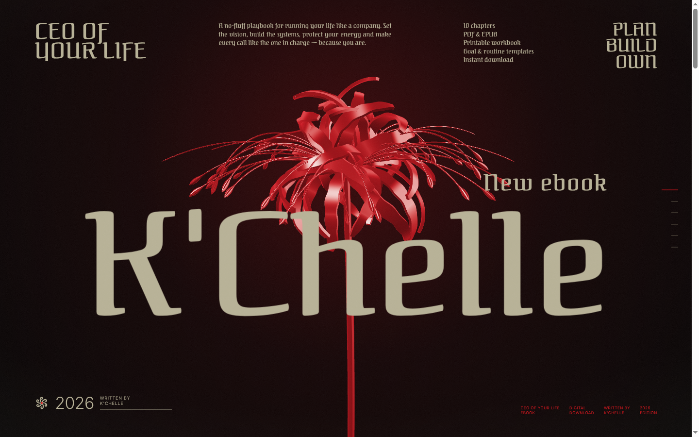
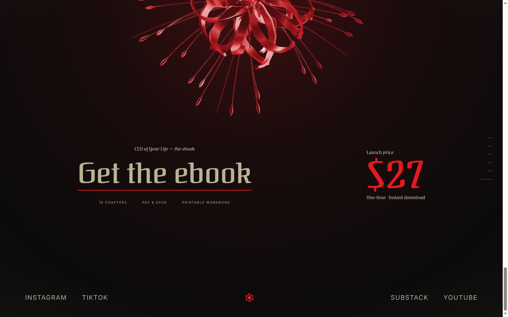
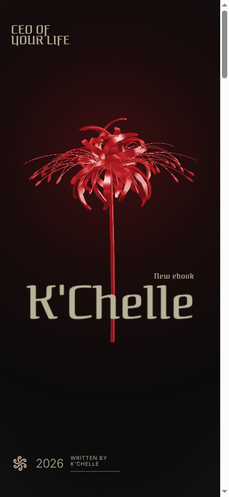

# CEO of Your Life — K'Chelle

Scroll-driven ebook landing page. A 3D red chrome spider lily (raw WebGL) turns and flies
while the page moves through six frames: Cover → Open → Inside → Promise → Bloom → Get it.

| Cover | Buy | Phone |
| --- | --- | --- |
|  |  |  |

## Change the copy

**Everything lives in `app/page.tsx`**, in the `EBOOK` block at the top: title, pitch,
chapters, price, button text, buy link, social links. You don't need to touch anything else.

Before going live:
- `ctaHref` — paste your Gumroad / Stan / Payhip / waitlist link (it's `#` right now, so the button goes nowhere).
- `links` — add `href: "https://..."` to each social once the account is live.
- The ebook content ("CEO of Your Life", chapters, $27) is a draft placeholder. Replace it with your real book.

## Run it

```bash
npm install
npm run dev
```

Open http://localhost:3000 and scroll.

## Put it online

Easiest: push this repo to GitHub, import it at vercel.com (free), done.

## Files

- `app/page.tsx` — your copy
- `components/ui/ebook-landing.tsx` — the page engine
- `components/ui/lycoris-specimen.tsx` — the original font-specimen component it's built from (credit: Kedhareswer, 21st.dev). Not used by the page; kept for reference.
